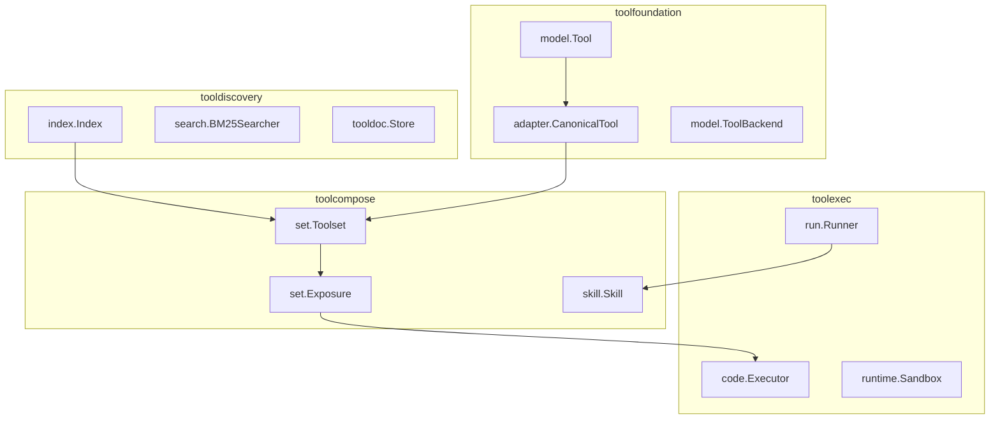
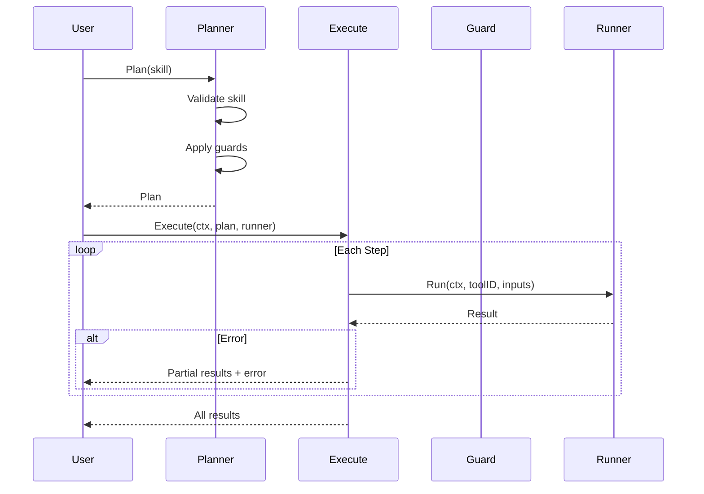

# toolcompose Design Notes

## Overview

toolcompose provides composition primitives for the ApertureStack ecosystem:

- **set**: build filtered, access-controlled tool collections
- **skill**: declare tool-based workflows and execute them deterministically

## Ecosystem Position



### Dependency Flow

| Package | Depends On | Provides To |
|---------|------------|-------------|
| toolfoundation | - | All packages (core types) |
| tooldiscovery | toolfoundation | toolcompose (registry source) |
| toolexec | toolfoundation, tooldiscovery | toolcompose (Runner impl) |
| toolcompose | toolfoundation | End users (composition API) |

## set Package

### Design Decisions

1. **Thread-safe Toolset**: Toolsets wrap a map with RW locks for safe concurrent access.
2. **Deterministic Ordering**: `IDs()` and `Tools()` return lexicographically sorted results.
3. **Pure Composition**: No I/O or execution; callers supply tools as input.
4. **Filter + Policy**: Filters reduce candidates; policies enforce access rules.
5. **Export via Adapters**: `Exposure` converts toolsets to protocol-specific shapes.

### Filter + Policy Semantics

- Filters are AND-composed in builder order.
- Policies run after filters.
- `nil` tools are always rejected.


### Thread Safety Model

| Type | Safe For | Notes |
|------|----------|-------|
| `Toolset` | Concurrent reads | Uses `sync.RWMutex` |
| `Builder` | Single goroutine | Configure, then call `Build()` once |
| `Exposure` | Concurrent reads | After construction only |
| `FilterFunc` | Must be thread-safe | If Toolset is shared |

### Error Handling

Sentinel errors enable programmatic handling:

```go
ts, err := builder.Build()
if errors.Is(err, set.ErrNoSource) {
    // No tools provided - call FromTools or FromRegistry
}
if errors.Is(err, set.ErrNilAdapter) {
    // Adapter is nil in Exposure
}
```

## skill Package

### Design Decisions

1. **Declarative Skills**: Skills are lightweight definitions of steps.
2. **Deterministic Planning**: Planner sorts steps by ID to guarantee stable execution order.
3. **Runner Interface**: Execution delegates to a `Runner` for tool integration.
4. **Guards**: Optional validation hooks (max steps, allowed tool IDs).
5. **Fail-fast Execution**: Execution stops on the first step error.


### Execution Model



### Guard Contract

Guards must be:
- **Idempotent**: Same skill → same result
- **Pure**: No side effects during `Check()`
- **Thread-safe**: If planner is shared

### Thread Safety Model

| Type | Safe For | Notes |
|------|----------|-------|
| `Planner` | Concurrent use | Stateless after construction |
| `Plan` | Concurrent reads | Immutable after creation |
| `Runner` | Implementation-dependent | Check implementation docs |
| `Guard` | Must be thread-safe | If Planner is shared |

### Error Handling

Sentinel errors for programmatic handling:

```go
plan, err := planner.Plan(skill)
if errors.Is(err, skill.ErrNoSteps) {
    // Skill has no steps defined
}
if errors.Is(err, skill.ErrMaxStepsExceeded) {
    // MaxStepsGuard rejected the skill
}
if errors.Is(err, skill.ErrToolNotAllowed) {
    // AllowedToolIDsGuard rejected a tool
}
```

## Trade-offs

| Decision | Benefit | Cost |
|----------|---------|------|
| No implicit parallelism | Deterministic, easy to reason about | Sequential execution only |
| Explicit runner adapter | No hard dependency on execution engine | Requires integration work |
| Binary policy | Simple allow/deny semantics | Rich policies need wrappers |
| Fail-fast execution | Errors surface immediately | No partial recovery |
| Deterministic ordering | Reproducible results | Sorting overhead |

## Integration Patterns

### With tooldiscovery

```go
// Build toolset from registry
ts, err := set.NewBuilder("github-tools").
    FromRegistry(registry).
    WithNamespace("github").
    Build()
```

### With toolexec

```go
// Execute skill with toolexec runner
runner := exec.NewRunner(executor)
planner := skill.NewPlanner(skill.PlannerOptions{Runner: runner})
plan, _ := planner.Plan(mySkill)
results, _ := skill.Execute(ctx, plan, runner)
```

### Protocol Export

```go
// Export for MCP server
exposure := set.NewExposure(ts, adapter.NewMCPAdapter())
tools, warnings, errs := exposure.ExportWithWarnings()
for _, w := range warnings {
    log.Printf("Feature %s lost converting %s → %s",
        w.Feature, w.FromAdapter, w.ToAdapter)
}
```
