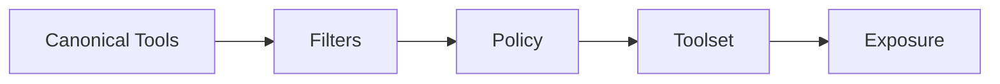

# toolcompose Design Notes

## Overview

toolcompose provides composition primitives:

- **set**: build filtered, access-controlled tool collections.
- **skill**: declare tool-based workflows and execute them deterministically.

## set Package

### Design Decisions

1. **Thread-safe Toolset**: Toolsets wrap a map with RW locks for safe concurrent access.
2. **Deterministic Ordering**: `IDs()` and `Tools()` return lexicographically sorted results.
3. **Pure Composition**: No I/O or execution; callers supply tools as input.
4. **Filter + Policy**: Filters reduce candidates; policies enforce access rules.
5. **Export via Adapters**: `Exposure` converts toolsets to protocol-specific shapes.

### Filter + Policy Semantics

- Filters are AND-composed in builder order.
- Policies run after filters.
- `nil` tools are always rejected.

## skill Package

### Design Decisions

1. **Declarative Skills**: Skills are lightweight definitions of steps.
2. **Deterministic Planning**: Planner sorts steps by ID to guarantee stable execution order.
3. **Runner Interface**: Execution delegates to a `Runner` for tool integration.
4. **Guards**: Optional validation hooks (max steps, allowed tool IDs).
5. **Fail-fast Execution**: Execution stops on the first step error.

## Trade-offs

- **No implicit parallelism**: Keeps execution deterministic and easy to reason about.
- **Explicit runner adapter**: Avoids hard dependency on a specific execution engine.
- **Policy is binary**: Access is allow/deny; richer policy engines can wrap `PolicyFunc`.
